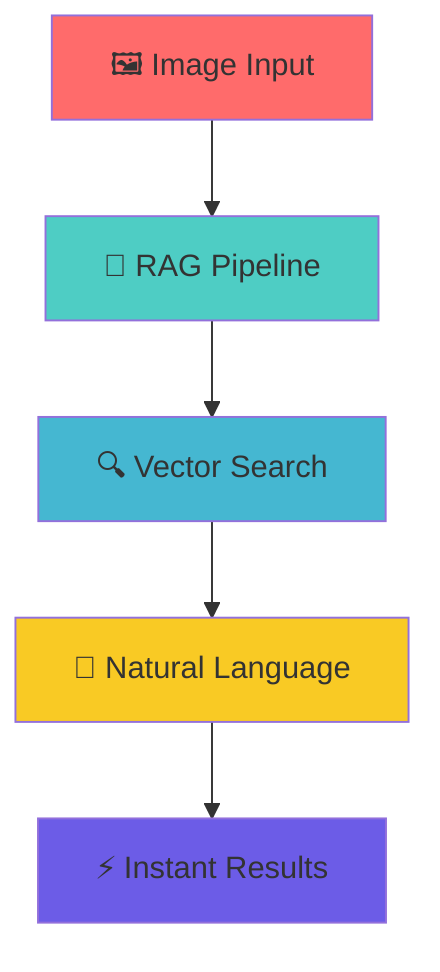
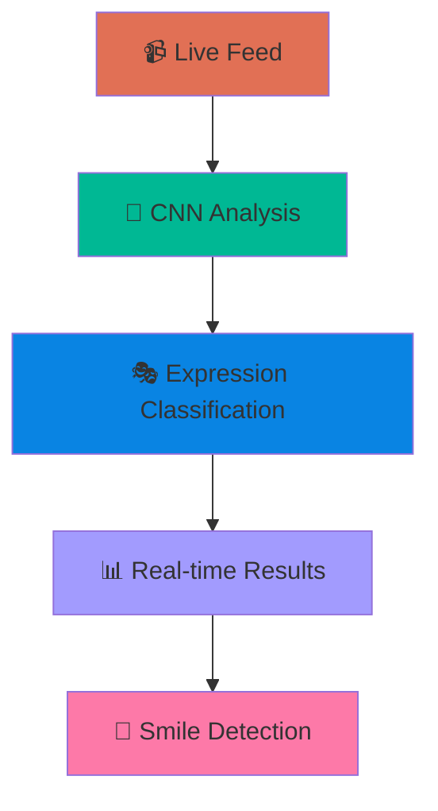
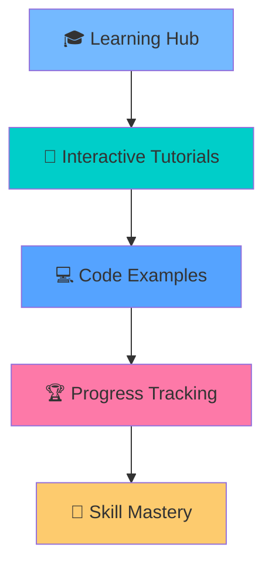
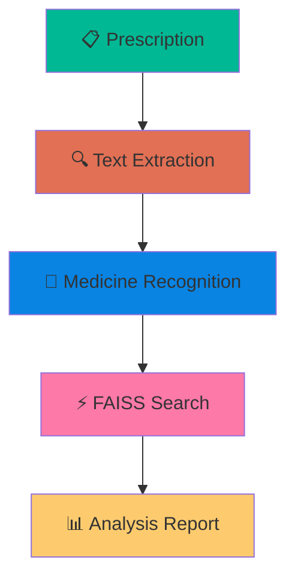

# <div align="center">🌟 SYEED MD TALHA 🌟</div>

<div align="center">

<!-- 3D Animated Header -->


<!-- Matrix Rain Effect -->


</div>

<!-- Holographic Typing Animation -->
<div align="center">

</div>

<!-- 3D Rotating Badges -->
<div align="center">
<br>


</div>

---

<!-- 3D Neon Section Divider -->
<div align="center">

</div>

## <div align="center">🌟 DIGITAL IDENTITY MATRIX 🌟</div>

<div align="center">
<table border="0">
<tr>
<td align="center" width="50%">

```css
/* 3D Hologram Profile */
.developer {
  position: absolute;
  background: linear-gradient(45deg, #00ff41, #0099ff);
  transform: rotateY(15deg) rotateX(5deg);
  box-shadow: 0 0 50px #00ff41;
  animation: float 6s ease-in-out infinite;
}

@keyframes float {
  0%, 100% { transform: translateY(0px); }
  50% { transform: translateY(-20px); }
}
```

</td>
<td align="center" width="50%">

```python
class EliteProgrammer:
    def __init__(self):
        self.name = "🚀 SYEED MD TALHA"
        self.level = "🏆 GRANDMASTER STATUS"
        self.power = "∞ INFINITE POTENTIAL"
        self.mission = "🌍 CHANGING THE WORLD"
    
    def achievements(self):
        return {
            "problems_solved": "2982+ 💥",
            "ai_projects": "REVOLUTIONARY 🤖",
            "contests": "270+ BATTLES WON ⚔️",
            "impact": "GLOBAL SCALE 🌐"
        }
```

</td>
</tr>
</table>
</div>

<!-- Animated Connection Badges -->
<div align="center">
<br>

[](https://www.linkedin.com/in/SyeedTalha/)
[](mailto:syeedmdtalha@gmail.com)
[](https://www.facebook.com/syeedmd.talha)

</div>

---

<!-- Cyberpunk Divider -->
<div align="center">

</div>

## <div align="center">🎮 COMPETITIVE PROGRAMMING ARENA 🎮</div>

<!-- 3D Stats Dashboard -->
<div align="center">

### ⚡ POWER LEVEL: OVER 9000! ⚡


</div>

<!-- Holographic Platform Stats -->
<div align="center">
<br>

<table>
<tr>
<td align="center" width="20%">

### 🟡 LEETCODE

<br>

<br>
**⚡ EXPERT LEVEL**

</td>
<td align="center" width="20%">

### 🔵 CODEFORCES  

<br>

<br>
**🚀 PUPIL WARRIOR**

</td>
<td align="center" width="20%">

### 🟠 CODECHEF

<br>

<br>
**⭐ 3 STAR MASTER**

</td>
<td align="center" width="20%">

### 🟢 ATCODER

<br>

<br>
**🎯 PRECISION STRIKER**

</td>
<td align="center" width="20%">

### 🔴 MULTI-PLATFORM

<br>

<br>
**👑 LEGENDARY STATUS**

</td>
</tr>
</table>

</div>

<!-- 3D Trophy Cabinet -->
<div align="center">
<br>

### 🏆 HALL OF LEGENDS 🏆


</div>

---

<!-- Neon Divider -->
<div align="center">

</div>

## <div align="center">🤖 AI/ML TECHNOLOGY MATRIX 🤖</div>

<!-- 3D Tech Stack Visualization -->
<div align="center">

### ⚡ NEURAL NETWORK ARCHITECTURE ⚡

<table>
<tr>
<td align="center" width="25%">

**🧠 AI/ML CORE**
<br><br>

<br>

<br>


</td>
<td align="center" width="25%">

**💻 PROGRAMMING ARSENAL**
<br><br>

<br>

<br>


</td>
<td align="center" width="25%">

**🌐 WEB DOMINATION**
<br><br>

<br>

<br>


</td>
<td align="center" width="25%">

**🛠️ POWER TOOLS**
<br><br>

<br>

<br>


</td>
</tr>
</table>

</div>

<!-- Skill Progress Bars with 3D Effect -->
<div align="center">
<br>

### 🎯 MASTERY LEVELS 🎯

```
AI/ML Engineering    ████████████████████░   95%
Problem Solving      ████████████████████░   98%
Algorithm Design     ███████████████████░░   90%
Full Stack Dev       ██████████████████░░░   85%
Competitive Coding   ████████████████████░   97%
System Architecture  ████████████████░░░░░   80%
```

</div>

---

<!-- Holographic Divider -->
<div align="center">

</div>

## <div align="center">🚀 PROJECT SHOWCASE UNIVERSE 🚀</div>

<!-- 3D Project Cards -->
<div align="center">

<table>
<tr>
<td width="50%" align="center">

### 🤖 AI PHOTO GALLERY CHATBOT
**〔 REVOLUTIONARY RAG ARCHITECTURE 〕**




**🎯 FEATURES:**
- 🔮 Conversational Image Search
- 🧠 Advanced NLP Processing  
- ⚡ Real-time Vector Retrieval
- 🎨 Contextual Display Engine

</td>
<td width="50%" align="center">

### 😊 FACIAL EXPRESSION AI
**〔 REAL-TIME EMOTION DETECTION 〕**




**🎯 CAPABILITIES:**
- 📹 Live Video Processing
- 🎭 Multi-Expression Recognition
- ⚡ FastAPI Backend
- 🧠 Deep Learning Models

</td>
</tr>
<tr>
<td width="50%" align="center">

### 📚 CODE-QUEST TUTORIALS
**〔 NEXT-GEN LEARNING PLATFORM 〕**




**🎯 INNOVATIONS:**
- 🎨 Responsive Design
- 📱 Mobile Optimized
- 🎓 Interactive Learning
- 🌐 Multi-language Support

</td>
<td width="50%" align="center">

### 🩺 MEDICAL AI SUITE
**〔 HEALTHCARE REVOLUTION 〕**




**🎯 BREAKTHROUGH TECH:**
- 🔬 OCR + AI Recognition
- 💊 Drug Interaction Analysis
- 📝 Handwriting Processing
- ⚡ Vector Similarity Search

</td>
</tr>
</table>

</div>

---

<!-- Cyberpunk Stats Section -->
<div align="center">

</div>

## <div align="center">📊 NEURAL ANALYTICS DASHBOARD 📊</div>

<!-- 3D GitHub Stats -->
<div align="center">

<table>
<tr>
<td width="50%">


</td>
<td width="50%">


</td>
</tr>
</table>

</div>

<!-- Contribution Snake Game -->
<div align="center">
<br>

### 🐍 CONTRIBUTION MATRIX 🐍


</div>

<!-- Activity Graph -->
<div align="center">
<br>

### ⚡ NEURAL ACTIVITY PATTERNS ⚡


</div>

---

<!-- Final Epic Section -->
<div align="center">

</div>

## <div align="center">🌟 MISSION CONTROL CENTER 🌟</div>

<div align="center">

### 🎯 CURRENT OBJECTIVES 🎯

<table>
<tr>
<td align="center" width="33%">

**🤖 AI DOMINANCE**
<br><br>
🧠 Advanced Deep Learning
<br>
🔮 Neural Architecture Search  
<br>
⚡ Edge AI Deployment
<br>
🌍 Global AI Solutions

</td>
<td align="center" width="33%">

**🏆 COMPETITIVE MASTERY**
<br><br>
🥇 Target: Specialist+
<br>
📈 Rating Optimization
<br>
🎯 Contest Consistency
<br>
🚀 Algorithm Innovation

</td>
<td align="center" width="33%">

**🌐 FULL-STACK EMPIRE**
<br><br>
☁️ Cloud Architecture
<br>
📱 Mobile Innovation
<br>
🔧 DevOps Mastery
<br>
🌟 Open Source Impact

</td>
</tr>
</table>

</div>

<!-- Epic Quote Section -->
<div align="center">
<br>

### 💭 PHILOSOPHY 💭


</div>

---

<!-- Connection Call-to-Action -->
<div align="center">

### 🤝 JOIN THE REVOLUTION 🤝

<table>
<tr>
<td align="center" width="25%">

**🔗 CONNECT**
<br><br>
[](https://www.linkedin.com/in/SyeedTalha/)

</td>
<td align="center" width="25%">

**📧 COLLABORATE**
<br><br>
[](mailto:syeedmdtalha@gmail.com)

</td>
<td align="center" width="25%">

**💻 CODE TOGETHER**
<br><br>
[](https://leetcode.com/syeedmdtalha)

</td>
<td align="center" width="25%">

**🏆 COMPETE**
<br><br>
[](https://codeforces.com/profile/syeedmdtalha)

</td>
</tr>
</table>

</div>

<!-- Final Epic Footer -->
<div align="center">
<br>


### 🌟 REMEMBER: THE BEST CODE IS YET TO BE WRITTEN! 🌟


</div>
